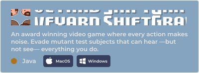
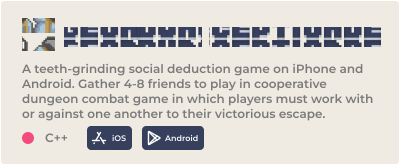

##  Hey There! I'm Marcos Eizayaga 

-----
###  ABOUT ME

-  Student at Cornell University School of Engineering | Class of '23
- 📚 Studying Information Science, Systems & Technology
- 🇦🇷 🇺🇸 Bilingual and Bicultural
-  SWE Intern @ Microsoft | Summer 2022
- 🥁 Passionate about Jazz Drumming and Singing

<!-- Pinned Repositories -->

---
###  PROJECTS WORTH CHECKING OUT

 

<!-- Made in figma https://www.figma.com/file/nzoWO3YaSIyDHFrVbhJ1cd/Github-Readme -->

 

  <!-- Made in figma https://www.figma.com/file/nzoWO3YaSIyDHFrVbhJ1cd/Github-Readme -->
  

 

  <a href="https://testflight.apple.com/join/nqhmC7Kf" target="_blank" rel="noopener noreferrer">
    <!-- Made in figma https://www.figma.com/file/nzoWO3YaSIyDHFrVbhJ1cd/Github-Readme -->
    
  </a> 
  &nbsp;
  <a href="https://drive.google.com/file/d/1MND-OEYt1AMIv7W9ScBkZED2DBCfuevx/view?usp=drivesdk">
    <!-- Made in figma https://www.figma.com/file/nzoWO3YaSIyDHFrVbhJ1cd/Github-Readme -->
    
  </a> 

---
###  LANGUAGES + TOOLS

&nbsp;

&nbsp;

&nbsp;

&nbsp;

&nbsp;

&nbsp;
![Adobe Illustrator](https://img.shields.io/badge/Chromium-1970E2?style=for-the-badge&logo=data:image/svg+xml;base64,PHN2ZyB3aWR0aD0iMjUxIiBoZWlnaHQ9IjI1MSIgdmlld0JveD0iMCAwIDI1MSAyNTEiIGZpbGw9Im5vbmUiIHhtbG5zPSJodHRwOi8vd3d3LnczLm9yZy8yMDAwL3N2ZyI+CjxwYXRoIGZpbGwtcnVsZT0iZXZlbm9kZCIgY2xpcC1ydWxlPSJldmVub2RkIiBkPSJNMjUxIDEyNS41QzI1MSAxOTQuODEyIDE5NC44MTIgMjUxIDEyNS41IDI1MUMxMjMuMDk2IDI1MSAxMjAuNzA4IDI1MC45MzIgMTE4LjMzNyAyNTAuNzk5TDE3NC40NzYgMTU2QzE3OS44OCAxNDcuMjg2IDE4MyAxMzcuMDA3IDE4MyAxMjZDMTgzIDEwOS45MDMgMTc2LjMyOCA5NS4zNjUgMTY1LjU5OCA4NUgyNDQuMzIyQzI0OC42NTEgOTcuNzA2IDI1MSAxMTEuMzI5IDI1MSAxMjUuNVpNMTQzIDE4MC40MjJMMTAyLjQ2NSAyNDguODkxQzQ0LjE1NTEgMjM4LjA3NCAwIDE4Ni45NDMgMCAxMjUuNUMwIDEwMC42NzUgNy4yMDgwNiA3Ny41MzMxIDE5LjY0NTUgNTguMDUzNkw3Ny41MjQzIDE1NkM4Ny41NzU0IDE3Mi4yMDcgMTA1LjUyNyAxODMgMTI2IDE4M0MxMzEuOTIxIDE4MyAxMzcuNjMxIDE4Mi4wOTcgMTQzIDE4MC40MjJaTTEyNS41IDBDODYuOTkwNCAwIDUyLjUzMiAxNy4zNDQ4IDI5LjUxMDYgNDQuNjQ4NEw2OS45NjUxIDExNS41Qzc0Ljg5MzEgODkuMDM1NCA5OC4xMDY4IDY5IDEyNiA2OUgyMzcuNTkzQzIxNi45MjEgMjguMDY4MiAxNzQuNDg4IDAgMTI1LjUgMFpNMTI1LjUgMTY2QzE0Ny44NjggMTY2IDE2NiAxNDcuODY4IDE2NiAxMjUuNUMxNjYgMTAzLjEzMiAxNDcuODY4IDg1IDEyNS41IDg1QzEwMy4xMzIgODUgODUgMTAzLjEzMiA4NSAxMjUuNUM4NSAxNDcuODY4IDEwMy4xMzIgMTY2IDEyNS41IDE2NloiIGZpbGw9IndoaXRlIi8+Cjwvc3ZnPgo=&logoColor=white)

 

&nbsp;

&nbsp;

&nbsp;

&nbsp;

&nbsp;

&nbsp;

&nbsp;

----
###  THINGS I'M CURRENTLY TRYING TO LEARN
- &nbsp;&nbsp;&nbsp;
   - Would love to explore MongoDB and GraphQL for their focus on fast development and scalability.
   - I started a collaborative markdown editor WebApp using Github OAuth2, GraphQL, MongoDB, and WebSockets.
   - &nbsp;

-  &nbsp;&nbsp;&nbsp;
   - I'm interested in game development using C#. Started to use Godot as my open source game engine for hobby games.
   - Sneak Peak of the main character: &nbsp;&nbsp;

-  &nbsp;
   - I want to learn Rust for its unique approach on safety and speed.